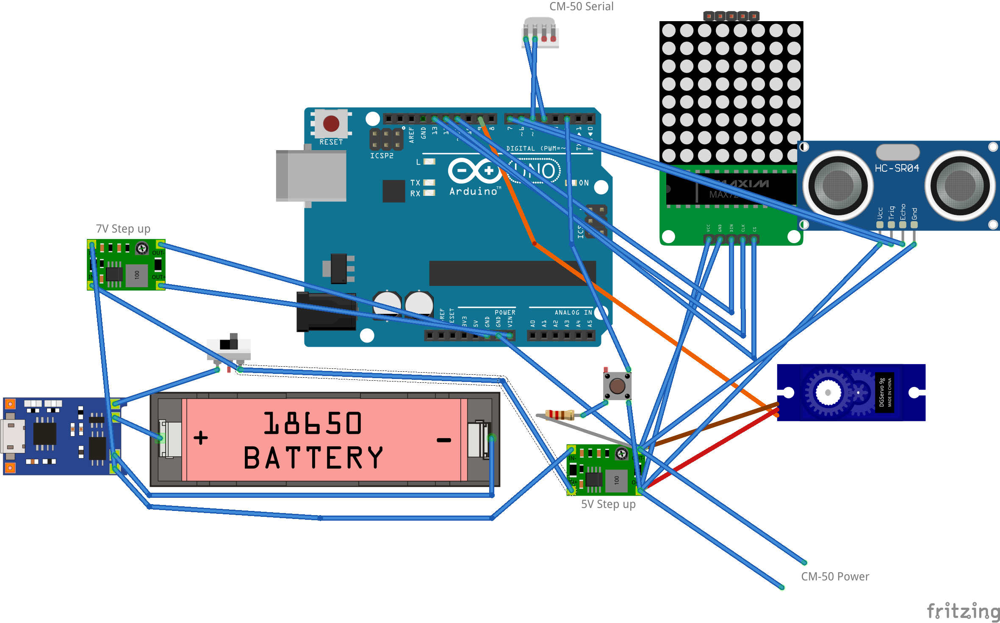

# OlbinBot
Olbin Coding bot based on Arduino and Mblock

## Pin Layout

- 18650 배터리 하나를 두 개의 step up converter를 이용하여 5V (부품 전원) 및 7V(아두이노 Vin)로 승압
- 푸시버튼 : 1k Pull down 저항을 이용하여 아두이노 2번과 연결
- 초음파센서 : Trig(7), Echo(6) 및 Vcc(5v), GND 연결
- CM-50 : 시리얼 연결 포트가 배터리 넣는 곳에서 보았을 때 왼쪽 부터 0번이라고 하면, 0번 - 아두이노 4번, 1번 - 아두이노 5번
- MAX7219 8x8 Dot Matrix : DIN, CS, CLK를 각각 11,12,13 번 핀에 연결
- 서보모터 : 시그널 핀을 9번에 연결

## Arduino Code
Arduino 폴더 아래 아두이노 코드는 mBlock의 라이브 모드를 위한 펌웨어 코드 입니다.

컴파일된 바이너리는 mBlock extension에 이미 포함되어 있습니다.

## mBlock Extension
mext 파일을 extension builder에서 import 하시면 코드확인이 가능합니다. 이 파일을 mBlock desktop app에 drag&drop 하시면 장치에 Olbin Bot이 추가됩니다.
    
     

